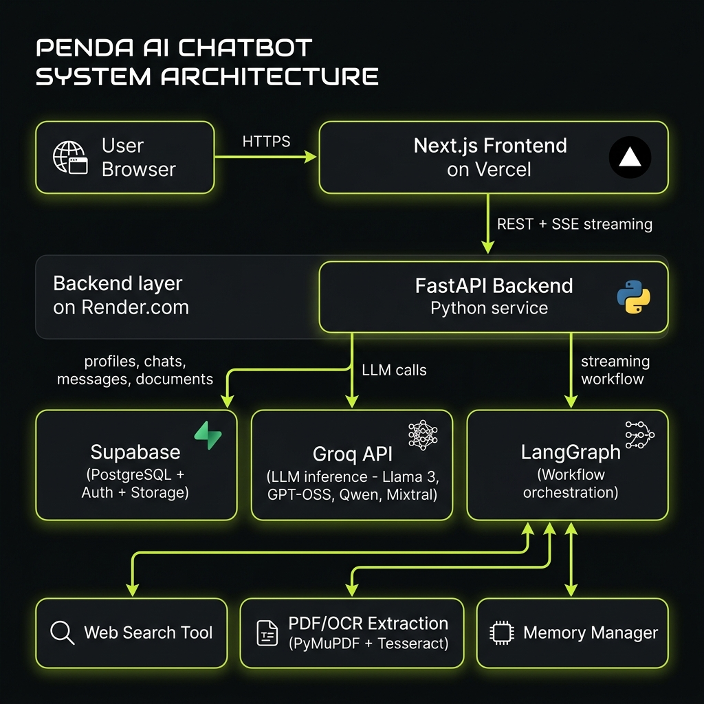

# ✳ Penda — AI Chat Assistant

> **A full-stack, production-grade AI chatbot** with streaming LLM responses, PDF document intelligence, persistent memory, web search, and an ATS (Applicant Tracking System) module — built on Next.js + FastAPI + LangGraph + Supabase.



---

## 🌐 Live Demo

| Service | URL |
|---------|-----|
| Frontend | [chat-bot-xi-orcin.vercel.app](https://chat-bot-xi-orcin.vercel.app) |
| Backend API | Render (FastAPI) |

---

## ✨ Feature Overview

| Feature | Details |
|---------|---------|
| **Real-time streaming** | Token-by-token streaming via Server-Sent Events (SSE) |
| **Multiple LLMs** | Llama 3.1/3.3, Llama 4 Scout, GPT-OSS 20B/120B, Qwen3, Mixtral, Groq Compound |
| **PDF & Document Chat** | Attach PDFs/text inline; OCR fallback for image-based PDFs (PyMuPDF + Tesseract) |
| **Global Documents** | Upload docs to your library; auto-injected into every chat as context |
| **Persistent Memory** | User facts extracted per conversation; injected in future sessions |
| **Web Search Tool** | LangGraph tool node that searches the web in real time |
| **BYOK (Bring Your Own Key)** | Use your own Groq API key to unlock all models + bypass trial limits |
| **Trial Token Limit** | Free-tier users get a token budget tracked atomically in Supabase |
| **Chat Sharing** | Generate a public share link for any conversation |
| **ATS Dashboard** | Upload resumes + JDs → AI critique + refined bullet points + hiring pipeline |
| **Auth** | Supabase Auth (email/password) with JWT verification |
| **Rate Limiting** | Per-user, per-IP rate limiting on all sensitive endpoints |
| **Prompt Injection Guard** | Regex-based sanitization of externally-sourced content |

---

## 🏗️ System Architecture

```
┌──────────────────┐   HTTPS    ┌──────────────────────────────┐
│   User Browser   │ ─────────► │  Next.js 14 (App Router)     │
└──────────────────┘            │  Hosted on Vercel             │
                                └──────────────┬───────────────┘
                                               │ REST + SSE Streaming
                                               ▼
                                ┌──────────────────────────────┐
                                │  FastAPI (Python 3.12)        │
                                │  Hosted on Render.com         │
                                │  ┌──────────────────────────┐│
                                │  │ LangGraph Workflow        ││
                                │  │  ├── Web Search Tool      ││
                                │  │  ├── PDF/OCR Extraction   ││
                                │  │  └── Memory Manager       ││
                                │  └──────────────────────────┘│
                                └───┬──────────┬──────────┬───┘
                                    │          │          │
                          ┌─────────▼──┐ ┌─────▼────┐ ┌──▼──────┐
                          │  Supabase  │ │ Groq API │ │Tiktoken │
                          │ PostgreSQL │ │   LLMs   │ │ (count) │
                          │ Auth       │ └──────────┘ └─────────┘
                          │ Storage    │
                          └────────────┘
```

### Key Data Flows

1. **Chat Request**: Browser → Next.js → `POST /chat/stream` → LangGraph workflow → Groq API → SSE token stream back
2. **Document Upload**: Browser file picker → `POST /documents` (multipart) → PyMuPDF text extraction (thread pool) → Supabase Storage + PostgreSQL metadata
3. **Memory**: After each response → `extract_user_facts` + `manage_memory` (async background tasks, non-blocking)
4. **ATS**: `POST /ats/upload` → PDF text extraction → `POST /ats` → 2-step LangGraph workflow → critique + refined bullets

---

## 📁 Project Structure

```
chatbot/
├── backend/                  # FastAPI Python service
│   ├── main.py               # All routes + SSE streaming + middleware
│   ├── database.py           # Supabase client + all DB helpers
│   ├── graph.py              # LangGraph workflow definition
│   ├── memory.py             # User fact extraction + context management
│   ├── tools.py              # Web search + calculator tools
│   ├── auth.py               # Supabase Auth wrappers (signup/login/refresh)
│   ├── rate_limiter.py       # In-memory sliding-window rate limiter
│   ├── schema.sql            # Base DB schema (Supabase)
│   ├── schema_v2.sql         # Migration: shared chats
│   ├── schema_v3.sql         # Migration: storage + ATS + pgvector
│   ├── schema_v4_file_name.sql  # Migration: message file_name column
│   ├── requirements.txt      # Python dependencies
│   └── .env.example          # Required environment variables
│
├── frontend/                 # Next.js 14 (App Router, TypeScript)
│   ├── app/
│   │   ├── chat/[chatId]/    # Dynamic chat page
│   │   ├── auth/             # Login / Signup / Reset password
│   │   ├── ats/              # ATS Dashboard page
│   │   └── share/[token]/    # Public shared chat view
│   ├── components/
│   │   ├── ChatWindow.tsx    # Main chat UI (messages + input)
│   │   ├── ChatInput.tsx     # Input bar with file attach + upload state
│   │   ├── MessageBubble.tsx # Markdown rendering + code highlighting
│   │   ├── Sidebar.tsx       # Chat list + navigation
│   │   ├── SettingsModal.tsx # Profile + BYOK key + model selection
│   │   ├── ATSDashboard.tsx  # ATS upload + pipeline UI
│   │   └── ShareModal.tsx    # Share link generator
│   ├── store/chatStore.ts    # Zustand state management
│   ├── lib/api.ts            # Typed API client (with retry + backoff)
│   └── types/index.ts        # Shared TypeScript types
│
├── render.yaml               # Render.com deployment config
└── README.md
```

---

## 🚀 Getting Started

### Prerequisites

- Node.js ≥ 18
- Python ≥ 3.12
- [Supabase](https://supabase.com) project (free tier works)
- [Groq API key](https://console.groq.com) (free tier works)

### 1. Clone & Setup Backend

```bash
git clone https://github.com/your-repo/chatbot.git
cd chatbot/backend

# Create virtual environment
python -m venv .venv
source .venv/bin/activate  # Windows: .venv\Scripts\activate

# Install dependencies
pip install -r requirements.txt

# Copy and fill in environment variables
cp .env.example .env
# Edit .env with your keys (see Environment Variables section below)
```

### 2. Setup Database (Supabase)

Run the SQL migrations **in order** in your Supabase SQL Editor:

```sql
-- 1. Base schema
\i backend/schema.sql

-- 2. Shared chats
\i backend/schema_v2.sql

-- 3. Storage + ATS + pgvector
\i backend/schema_v3_minimal.sql

-- 4. Message file_name column (NEW)
\i backend/schema_v4_file_name.sql
```

### 3. Start Backend

```bash
cd backend
uvicorn main:app --reload --port 8000
```

API docs available at: http://localhost:8000/docs

### 4. Setup & Start Frontend

```bash
cd frontend

# Install dependencies
npm install

# Copy and fill in environment variables
cp .env.local.example .env.local
# Set NEXT_PUBLIC_API_URL=http://localhost:8000

# Start dev server
npm run dev
```

Frontend available at: http://localhost:3000

---

## 🔑 Environment Variables

### Backend (`backend/.env`)

| Variable | Required | Description |
|----------|----------|-------------|
| `GROQ_API_KEY` | ✅ | Your Groq API key (used for trial users) |
| `SUPABASE_URL` | ✅ | Your Supabase project URL |
| `SUPABASE_SERVICE_ROLE_KEY` | ✅ | Supabase service role key (bypasses RLS) |
| `SUPABASE_JWT_SECRET` | ✅ | Supabase JWT secret (for token verification) |
| `BYOK_ENCRYPTION_KEY` | ✅ | Fernet key for encrypting BYOK API keys (`python -c "from cryptography.fernet import Fernet; print(Fernet.generate_key().decode())"`) |
| `FRONTEND_URL` | ✅ | Frontend origin URL (for CORS + password reset links) |
| `ALLOWED_ORIGINS` | ✅ | Comma-separated list of allowed CORS origins |
| `RENDER_EXTERNAL_URL` | ⚠️ Render only | Your Render backend URL — enables keep-alive pings |
| `LOG_LEVEL` | ❌ | Logging level (default: `INFO`) |
| `OPENAI_API_KEY` | ❌ | Only needed for pgvector embeddings (RAG) |

### Frontend (`frontend/.env.local`)

| Variable | Required | Description |
|----------|----------|-------------|
| `NEXT_PUBLIC_API_URL` | ✅ | Backend API URL (e.g. `https://penda-backend.onrender.com`) |
| `NEXT_PUBLIC_SUPABASE_URL` | ✅ | Supabase project URL |
| `NEXT_PUBLIC_SUPABASE_ANON_KEY` | ✅ | Supabase anon key (public) |

---

## 🤖 How the Chat Works

### Streaming Pipeline

```
User sends message
      │
      ▼
[rate limit check] → 429 if exceeded
      │
      ▼
[JWT auth] → 401 if invalid
      │
      ▼
[trial token check] → 429 if limit reached
      │
      ▼
[save user message] (with optional file_name)
      │
      ▼
[build context] = memory facts + chat history + document chunks
      │
      ▼
[LangGraph astream_chat_workflow]
  ├── [assistant node] → streams tokens via Groq
  └── [tool nodes] → web_search, calculator, etc.
      │
      ▼
[SSE token stream] → frontend displays in real-time
      │
      ▼
[background tasks] (non-blocking)
  ├── save assistant message to DB
  ├── extract_user_facts
  ├── manage_memory (summarize if too long)
  └── increment_trial_tokens (if trial user)
```

### PDF Attachment Flow

```
User attaches PDF
      │
      ▼
[FileReader in browser] → reads as base64 DataURL
      │
      ▼
[ChatInput] shows "Reading file…" spinner
      │
      ▼
Sent as doc_content (base64) in chat request body
      │
      ▼
[Backend /chat/stream]
  → detects "data:application/pdf;base64," prefix
  → decodes base64 → runs PyMuPDF in thread pool
  → OCR fallback if no text (Tesseract)
  → injects as SystemMessage into LLM context
```

---

## 🐛 Bug Fixes (this release)

| Bug | Fix |
|-----|-----|
| `request` not injected in `upload_document` — PDF always ran blocking | Added `request: Request` param; always uses `ThreadPoolExecutor` |
| No upload progress feedback | Added spinning loader chip: "Reading file…" while `FileReader` runs |
| Attached file name not shown in chat history | `file_name` now saved to DB + fetched in `get_messages` + shown in `MessageBubble` |
| Render free tier sleeps between requests | Keep-alive task pings `/ping` every 12 min using `RENDER_EXTERNAL_URL` |
| `httpx.ReadError: [Errno 11] Resource temporarily unavailable` | This is a Supabase connection pool exhaustion on `get_profile`. The retry logic in the API client (5 attempts, exponential backoff) absorbs transient errors. The keep-alive also reduces cold-start reconnects. |

---

## 🔒 Security

- **JWT verification**: Supports both HS256 (Supabase JWT secret) and ES256/RS256 (JWKS) algorithms
- **BYOK encryption**: User API keys are encrypted at rest with Fernet (AES-128-CBC)
- **Rate limiting**: Sliding-window limits on chat (10/min), ATS (2/min), auth (5/min), forgot-password (3/hr)
- **Prompt injection guard**: Regex-based sanitization of web search results and document content
- **Body size limit**: 10 MB hard cap on all requests
- **Security headers**: `X-Frame-Options`, `X-Content-Type-Options`, `Referrer-Policy`
- **CORS**: Strict allowlist via `ALLOWED_ORIGINS` env var

---

## 📦 Tech Stack

### Backend
| Package | Version | Purpose |
|---------|---------|---------|
| `fastapi` | 0.115+ | Web framework + SSE |
| `uvicorn` | latest | ASGI server |
| `langchain-core` | latest | Message types |
| `langgraph` | latest | Workflow orchestration |
| `langchain-groq` | latest | Groq LLM integration |
| `supabase` | 2.x | DB + Auth + Storage client |
| `PyMuPDF (fitz)` | latest | PDF text extraction |
| `pytesseract` | optional | OCR fallback for image PDFs |
| `tiktoken` | latest | Token counting |
| `cryptography` | latest | Fernet BYOK encryption |
| `PyJWT` | latest | JWT verification |
| `httpx` | latest | Async HTTP (keep-alive pings) |

### Frontend
| Package | Purpose |
|---------|---------|
| `next` 14 | React framework (App Router) |
| `zustand` | Client state management |
| `framer-motion` | Animations |
| `react-markdown` + `remark-gfm` | Markdown rendering |
| `react-syntax-highlighter` | Code block syntax highlighting |
| `lucide-react` | Icons |
| `@supabase/supabase-js` | Auth client |
| `clsx` | Conditional class names |

---

## 🚢 Deployment

### Backend — Render.com

1. Connect your GitHub repo to Render
2. Create a new **Web Service** (or let `render.yaml` do it automatically)
3. Set all environment variables in the Render dashboard
4. Set `RENDER_EXTERNAL_URL` to your Render service URL (e.g. `https://penda-backend.onrender.com`) — this enables the keep-alive ping
5. Deploy — Render installs `tesseract-ocr` and `poppler-utils` automatically via `packages` in `render.yaml`

### Frontend — Vercel

```bash
cd frontend
npx vercel --prod
# Set NEXT_PUBLIC_API_URL, NEXT_PUBLIC_SUPABASE_URL, NEXT_PUBLIC_SUPABASE_ANON_KEY
```

---

## 📝 Contributing

1. Fork the repo
2. Create a feature branch: `git checkout -b feat/your-feature`
3. Commit your changes: `git commit -m "feat: add your feature"`
4. Push and open a PR

---

*Built by Saksham Vijay*
